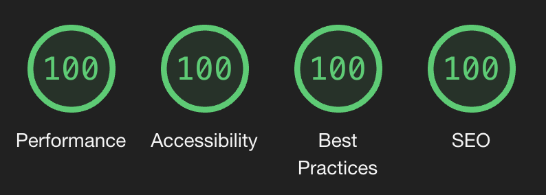

### Why Vite?

It's fast and no need to deal with Webpack. Also I'm a big Evan You fan.

### Why TypeScript?

I've experienced both in large-scale projects and always felt like TypeScript provided more robust code. Occasionnal `any`s are fine.

### Why MUI?

MUI enables for fast PoC work and is very easy to extend. Also I had a lot of experience with it.

### Why XYZ ESLint/Prettier rule?

Moslty personnal preferences. I'm open to changing them if they really bug you. 🙂

### Why Recharts?

I have worked a lot with Chart.js before and always felt like it was half baked. So far, Recharts works well for our use-case, but we may need something more powerful down the road. We'll see.

### Why is `React` never in scope?

[Not needed since React 17](https://reactjs.org/blog/2020/09/22/introducing-the-new-jsx-transform.html).

### Why no `export default`?

Default exports are simply harder to mock in tests, so we prefer named exports everywhere.

### Does the project support aliases in paths? (e.g. `@/components/...`)

Yep!

### Why `type` and not `interface`?

Types are just superior and easy to merge, without using `extends`. [Read more](https://pawelgrzybek.com/typescript-interface-vs-type/).

### Is performance important?

Yep! Just check out these Lighthouse scores 😎



### How to run a single test instead of the whole test suite?

`yarn test src/relative/path/MyFile.test.tsx`

### How to view file coverage?

Run:

```
yarn test
```

And then open the `coverage/index.html` file in your browser.

### Why no snapshot testing?

Snapshot diffs are annoying and often don't truly test anything. They get in the way and slow you down. Instead we:

- Use the `'it displays the right text'` test
- Use the `'it conditionally renders some markup'` test
- Use the `'it applies some CSS rules'` test

### Why use `.jsx` in test files and not `.tsx`?

2 reasons:

- You often get unhelpful TS errors when trying to test null/undefined values.
- The `pageLazyLoader` necessitates an explicit file type (`.tsx`), but this conflitcs with existing `.test.tsx` files and ends up bundling test files in the production bundle. We work around that by naming test files with the `.jsx` suffix.

### How to run the app using `https`?

Just add the `--https` flag:

```sh
yarn dev --https
```

### How to globally tweak MUI's components?

If your changes are global, and do not depend on the `theme` object, you should put them in the [`src/theming/overrides.ts`](/src/theming/overrides.ts) file.

### How to add new variables to the theme?

If you want to add new color variables, please do so in the [`src/theming/customPalette.ts`](/src/theming/customPalette.ts) file

#### For more info:

See [`src/theming/theme.ts`](/src/theming/theme.ts).

Basically, we set up automatic [TypeScript module augmentation](https://www.typescriptlang.org/docs/handbook/declaration-merging.html#module-augmentation) to extend the native MUI `Theme` type.
